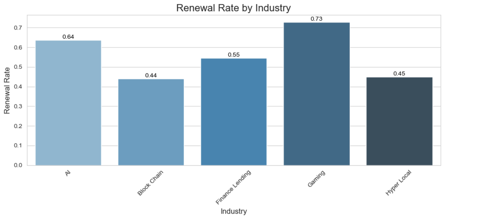
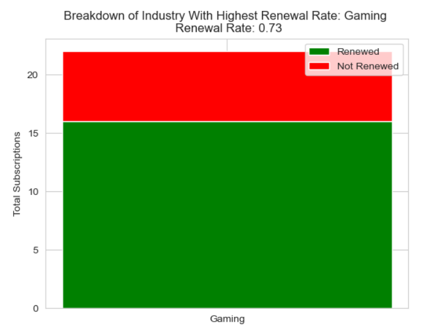
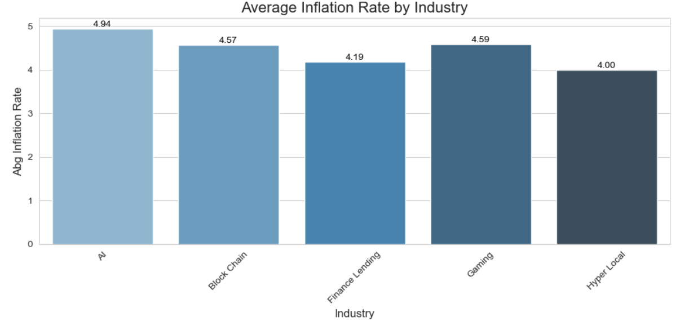
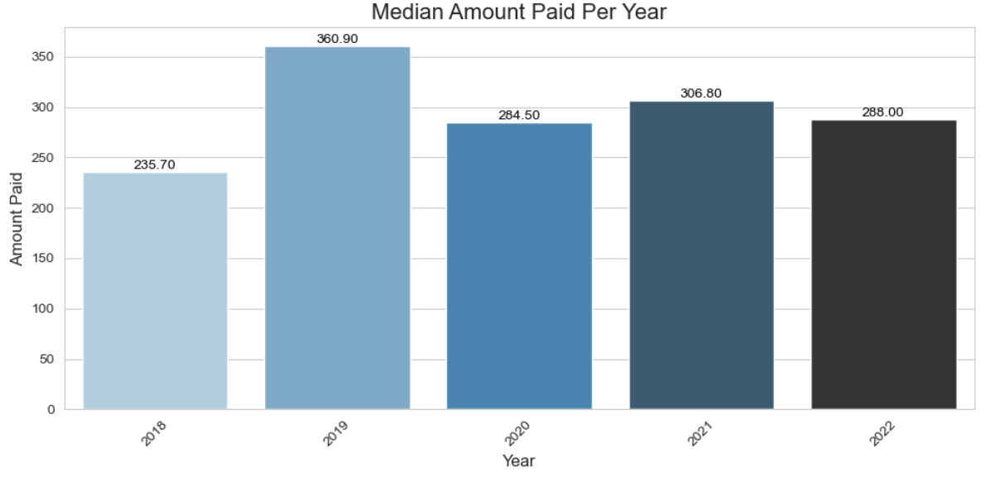

# **Data Analysis Project**

## **Overview**
This project focuses on analyzing various aspects of subscription and payment data using Python. The primary goal is to answer four data-related questions based on the provided datasets, which include industry-level subscription information, inflation rates, and payment methods. The analysis utilizes tools like Pandas, Matplotlib, and Seaborn for computation and visualization.

---

## **Questions and Approach**
### **1. Count of Clients in Finance Lending and Block Chain Industries**
- **Objective**: Identify the number of clients in two specific industries: `Finance Lending` and `Blockchain`.
- **Approach**:
  - Filter the dataset by the `industry` column to include only the two industries.
  - Count the number of rows matching each industry.
- **Result**: The output includes the total count for each of the two industries.
## Answer: 47 out of 100 clients belong to either Finance Lending or Block Chain industry
---

### **2. Renewal Rate Analysis by Industry**
- **Objective**: Calculate and identify the industry with the highest renewal rate based on subscription data.
- **Approach**:
  - Calculate the renewal rate for each industry using the formula:
    

\[
    \text{Renewal Rate} = \frac{\text{Total Renewed Subscriptions}}{\text{Total Subscriptions}} \times 100
    \]

  - Find the industry with the highest renewal rate and display detailed metrics such as total subscriptions, total renewed, and renewal percentages.
- **Result**: A summary table showing renewal rate metrics for each industry, along with a bar graph visualization.

---

### **3. Average Inflation Rate at Subscription Renewal**
- **Objective**: Determine the average inflation rate at the time subscriptions were renewed.
- **Approach**:
  - Merge subscription data with inflation rate data based on subscription renewal dates.
  - Use the `end_date` column from the `subscription_information` table to align renewal dates with inflation data.
  - Calculate the average inflation rate at renewal dates across all industries.
- **Result**: The output includes the calculated average inflation rate for all subscriptions at the time of renewal.
 

---

### **4. Median Amount Paid Per Year**
- **Objective**: Calculate the median amount paid for subscriptions each year, across all payment methods.
- **Approach**:
  - Extract the year from the `payment_date` column in the `payment_information` table.
  - Group the data by year and calculate the median of the
 

